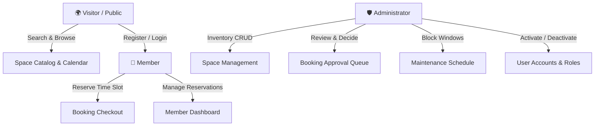

# 🏢 Co-working Space Desk & Room Booking System

> Hey there! 👋 This is a full-stack co-working management platform I built for my assignment. It lets members browse and book desks or meeting rooms for specific time slots — and gives admins a powerful dashboard to manage everything from space inventory to booking approvals and maintenance scheduling. No more double bookings, no more chaos. Just clean, conflict-safe reservations.

---

## 🌐 Live Demo — Try It Now!

The app is fully deployed and live. Go ahead, click around:

| What | Link |
| :--- | :--- |
| 🎨 **Frontend App** | [https://co-working-space-des-k-frountend.vercel.app](https://co-working-space-des-k-frountend.vercel.app) |
| ⚙️ **Backend API** | [https://co-working-space-desk-backend.vercel.app](https://co-working-space-desk-backend.vercel.app) |
| 📖 **Swagger API Docs** | [https://co-working-space-desk-backend.vercel.app/api-docs](https://co-working-space-desk-backend.vercel.app/api-docs) |
| 💓 **Health Check** | [https://co-working-space-desk-backend.vercel.app/health](https://co-working-space-desk-backend.vercel.app/health) |

---

## 🚦 CI/CD Pipelines

Both the frontend and backend have automated GitHub Actions pipelines that build and deploy on every push to `main`:

| Repo | Actions |
| :--- | :--- |
| 🖼️ **Frontend** | [View Workflow Runs](https://github.com/rajatpayaal/Co-working-Space-DesK-Frountend/actions) |
| 🔧 **Backend** | [View Workflow Runs](https://github.com/rajatpayaal/Co-working-Space-Desk-Backend/actions) |

---

## 📑 Table of Contents

1. [What This Project Is About](#-what-this-project-is-about)
2. [Who Can Use It — User Roles](#-who-can-use-it--user-roles)
3. [Features at a Glance](#-features-at-a-glance)
4. [How It's Built — Tech Stack](#️-how-its-built--tech-stack)
5. [Preventing Double Bookings — Concurrency Safety](#-preventing-double-bookings--concurrency-safety)
6. [API Reference](#-api-reference)
7. [Project Structure](#-project-structure)
8. [Running It Locally](#-running-it-locally)
9. [Docker](#-docker)
10. [Environment Variables](#-environment-variables)
11. [Assignment Checklist](#-assignment-checklist)

---

## 🏛 What This Project Is About

I built **CoWork Spot** to solve a real problem: managing a shared workspace is surprisingly hard. Who booked which desk? Did two people accidentally grab the same meeting room? Is that room even available during maintenance?

This platform handles all of that — with a warm, Sahara-themed UI that feels welcoming, not clinical. Here's what makes it interesting:

- **Zero double-bookings** — Database-level transactions ensure that even if two people click "Book" at the exact same moment, only one of them gets the slot.
- **Maintenance-aware scheduling** — Admins can block out time windows for cleaning or repairs. Blocked slots automatically disappear from the booking calendar.
- **Real-time availability** — A live slot calendar shows you exactly which hours are open on any given date, before you commit to a booking.
- **Smart conflict resolution** — When an admin approves a booking, any other pending requests that overlap it get automatically rejected. No manual cleanup needed.

---

## 👥 Who Can Use It — User Roles

There are three types of users in the system, each with their own experience:



### 🌍 Visitor (No Login Needed)
You don't need an account just to look around. Visitors can:
- Browse the full catalog of desks and meeting rooms — with photos, capacity, hourly price, and amenities
- Search by name or space type, filter by capacity, and sort results
- Check a live availability calendar for any date to see which hours are open
- Navigate from the landing page hero search directly to filtered results

### 👤 Member (Login Required)
Once you're signed in, you unlock the booking features:
- Register and log in with JWT-based authentication (tokens persist across sessions)
- Pick a workspace, choose a date and time range, and confirm — the system checks for conflicts in real time before letting you through
- View all your bookings in a personal dashboard with status badges (`PENDING`, `APPROVED`, `REJECTED`, `CANCELLED`)
- Cancel upcoming reservations yourself — the slot is released immediately

### 🛡️ Admin
Admins have a full-featured operations console:
- Create, edit, and delete workspace listings (name, capacity, hourly rate, amenities, images, active/inactive status)
- Review all bookings in the system — filter by status, approve or reject with optional reasons
- Schedule maintenance windows that automatically block booking slots in that time range
- Manage user accounts — view who's registered, toggle their active/inactive status
- A live dashboard with metric cards: total spaces, active bookings, pending approvals, maintenance windows, and revenue

---

## ✨ Features at a Glance

### 🔍 Search & Filters That Actually Work
The hero search bar on the landing page lets you pick a space type and team size, then serializes your choices into URL query params (`/spaces?type=MEETING_ROOM&capacity=team`). This means you can bookmark and share filtered views — and they'll restore correctly on load.

### 📅 Slot Calendar
Click any space → pick a date → see the live hourly schedule. Open slots are highlighted in green; taken ones are greyed out and crossed. Safe time rendering handles both ISO 8601 timestamps and simple `"HH:mm"` format from the API.

### 🛡 Concurrency Safety (No Double Booking)
Two members trying to book the same slot simultaneously? Here's what happens behind the scenes:

```
[Request 1: Member A] ───┐
                          ├──► [BEGIN DB TRANSACTION / LOCK]
[Request 2: Member B] ───┘           │
                                     ▼
                      Check Overlapping Bookings & Maintenance
                                     │
                 ┌───────────────────┴───────────────────┐
                 ▼                                       ▼
         [No Overlap Found]                     [Overlap Detected]
                 │                                       │
     Create Booking (PENDING)                    Rollback Transaction
                 │                                       │
            COMMIT TX                                    ▼
                 │                          HTTP 409 Conflict:
                 ▼                          "Slot is no longer available"
         HTTP 201 Created
```

The math behind overlap detection: two intervals overlap if and only if
$$\text{Overlap} \iff (\text{Start}_A < \text{End}_B) \land (\text{End}_A > \text{Start}_B)$$

### 🧭 Smooth Navigation
- Route changes auto-scroll to the top (via a custom `<ScrollToTop />` component)
- Clicking "Amenities" or "Pricing" in the nav from any page scrolls to the right section on the landing page — no broken anchor links
- Unauthenticated users hitting protected routes get redirected to login and bounced back to their intended page after signing in
- A custom Sahara-themed 404 page with smart back navigation (goes back in history if possible, otherwise goes home)

---

## 🛠️ How It's Built — Tech Stack

### Frontend
| Thing | Choice |
| :--- | :--- |
| Framework | React 19 + Vite 8 |
| Routing | React Router v7 (nested layouts, protected/guest guards, 404 catch-all) |
| Styling | Tailwind CSS with custom Sahara design tokens |
| HTTP | Axios with JWT interceptors and 401 auto-redirect |
| Error Handling | Class-based `<ErrorBoundary />` + per-page error banners |

### Backend
| Thing | Choice |
| :--- | :--- |
| Runtime | Node.js + Express |
| Database | PostgreSQL via Prisma ORM |
| Auth | JWT (access + refresh tokens) |
| Security | Rate limiting on auth routes, CORS, input validation |
| Concurrency | DB transactions with overlap checks |

---

## 🔒 Preventing Double Bookings — Concurrency Safety

Every booking goes through two checks:

1. **Pre-validation** (`POST /api/availability/check`) — the frontend asks the server "is this slot still free?" right before the user hits Confirm.
2. **Atomic transaction** (`POST /api/bookings`) — the actual booking creation happens inside a database transaction with an overlap query. If another booking snuck in between steps 1 and 2, this catches it and returns a 409.

When an admin **approves** a booking, the system automatically finds and rejects all other pending bookings that overlap with it — no manual cleanup, no forgotten conflicts.

---

## 📡 API Reference

### Public Endpoints (No Auth)

| Method | Endpoint | What It Does |
| :--- | :--- | :--- |
| `POST` | `/api/auth/register` | Create a new member account |
| `POST` | `/api/auth/login` | Sign in, receive JWT |
| `POST` | `/api/auth/refresh` | Get a fresh access token |
| `GET` | `/api/spaces` | List spaces (search, filter, paginate) |
| `GET` | `/api/spaces/:id` | Get full space details + amenities |
| `GET` | `/api/spaces/:id/slots` | Slot availability for a date (`?date=YYYY-MM-DD`) |
| `POST` | `/api/availability/check` | Pre-validate a time window |

### Member Endpoints (JWT Required)

| Method | Endpoint | What It Does |
| :--- | :--- | :--- |
| `GET` | `/api/bookings/my` | My bookings with statuses |
| `GET` | `/api/bookings/:id` | View a specific booking receipt |
| `POST` | `/api/bookings` | Create a booking (conflict-safe) |
| `PATCH` | `/api/bookings/:id/cancel` | Cancel a future booking |

### Admin Endpoints (Admin JWT Required)

| Method | Endpoint | What It Does |
| :--- | :--- | :--- |
| `GET` | `/api/admin/spaces` | All spaces including inactive |
| `POST` | `/api/admin/spaces` | Create a new workspace |
| `PATCH` | `/api/admin/spaces/:id` | Update space details |
| `DELETE` | `/api/admin/spaces/:id` | Remove a workspace |
| `GET` | `/api/admin/bookings` | All bookings across all spaces |
| `PATCH` | `/api/admin/bookings/:id/approve` | Approve + auto-reject conflicts |
| `PATCH` | `/api/admin/bookings/:id/reject` | Reject with reason |
| `GET` | `/api/admin/maintenance` | List maintenance windows |
| `POST` | `/api/admin/maintenance` | Schedule a maintenance blockout |
| `DELETE` | `/api/admin/maintenance/:id` | Remove a maintenance window |
| `GET` | `/api/admin/users` | All registered users |
| `PATCH` | `/api/admin/users/:id/activate` | Activate a user account |
| `PATCH` | `/api/admin/users/:id/deactivate` | Deactivate a user account |

---

## 📂 Project Structure

```
coworking-frontend/
├── public/                     # Static assets & icons
├── src/
│   ├── api/                    # All API communication lives here
│   │   ├── axios.js            # Base URL + JWT interceptors
│   │   ├── authApi.js          # Login, register, refresh
│   │   ├── spacesApi.js        # Catalog + admin space endpoints
│   │   ├── bookingsApi.js      # Reservation + approval workflows
│   │   ├── adminApi.js         # Maintenance, users, RBAC
│   │   └── responseHelpers.js  # Safe API response unwrapping
│   ├── components/
│   │   ├── common/             # Reusable UI primitives
│   │   │   ├── Button.jsx      # Sahara-styled buttons with loading state
│   │   │   ├── Input.jsx       # Labeled inputs with icons + errors
│   │   │   ├── Badge.jsx       # Status badges (pending, approved, etc.)
│   │   │   ├── Modal.jsx       # Accessible dialog modals
│   │   │   ├── EmptyState.jsx  # Empty table / no-results illustrations
│   │   │   ├── LoadingSpinner.jsx  # Skeleton loaders + spinners
│   │   │   ├── ErrorBoundary.jsx   # React runtime crash protection
│   │   │   └── ScrollToTop.jsx     # Scroll reset on route change
│   │   └── layout/
│   │       ├── Header.jsx          # Navbar with cross-route hash scrolling
│   │       ├── PublicLayout.jsx    # Public wrapper with ErrorBoundary
│   │       ├── AdminLayout.jsx     # Admin frame with sidebar
│   │       └── AdminSidebar.jsx    # Admin navigation
│   ├── hooks/
│   │   └── useAuth.jsx         # Auth context, role helpers
│   ├── pages/
│   │   ├── public/
│   │   │   ├── Landing.jsx         # Hero page with search bar
│   │   │   ├── ExploreSpaces.jsx   # Filterable workspace directory
│   │   │   ├── SpaceDetails.jsx    # Detail view + slot calendar
│   │   │   ├── BookingCheckout.jsx # Reservation confirmation
│   │   │   └── NotFound.jsx        # Sahara-themed 404
│   │   ├── auth/
│   │   │   ├── Login.jsx           # Sign-in with return redirect
│   │   │   └── Register.jsx        # Member signup
│   │   ├── member/
│   │   │   ├── Dashboard.jsx       # My upcoming bookings
│   │   │   ├── MyBookings.jsx      # Full bookings table + cancel
│   │   │   └── BookingDetails.jsx  # Single booking receipt
│   │   └── admin/
│   │       ├── Dashboard.jsx           # Metrics + quick actions
│   │       ├── SpaceManagement.jsx     # Space inventory table
│   │       ├── CreateEditSpace.jsx     # Create/edit form
│   │       ├── BookingManagement.jsx   # Approval queue
│   │       ├── MaintenanceManagement.jsx  # Maintenance scheduler
│   │       ├── UserManagement.jsx      # User directory + toggles
│   │       └── RolesPermissions.jsx    # RBAC matrix
│   ├── routes/
│   │   └── AppRoutes.jsx       # Route declarations + guards
│   ├── App.jsx
│   ├── main.jsx
│   └── index.css               # Tailwind + Sahara design tokens
├── Dockerfile                  # Multi-stage production build
├── docker-compose.yml
├── .env.example
├── package.json
└── vite.config.js
```

---

## 🚀 Running It Locally

### What You'll Need
- Node.js `v18+`
- npm / yarn / pnpm
- Git

### Steps

```bash
# 1. Clone the repo
git clone https://github.com/rajatpayaal/Co-working-Space-DesK-Frountend.git
cd Co-working-Space-DesK-Frountend

# 2. Set up your environment
cp .env.example .env
# The default .env points to the live production backend — no changes needed for a quick look
```

**.env contents:**
```env
VITE_API_BASE_URL=https://co-working-space-desk-backend.vercel.app/api
```

```bash
# 3. Install dependencies
npm install

# 4. Start dev server
npm run dev
# → Open http://localhost:5173
```

**Building for production:**
```bash
npm run build
npm run preview
```

---

## 🐳 Docker

Want to run the whole thing containerized? There's a production-ready multi-stage Docker build (Node 20 Alpine → Nginx Alpine, < 25MB final image):

```bash
# Build and start
docker-compose up --build -d

# Frontend → http://localhost:8080

# Stop
docker-compose down
```

---

## 🔧 Environment Variables

| Variable | What It's For | Default |
| :--- | :--- | :--- |
| `VITE_API_BASE_URL` | Backend API base URL for all requests | `https://co-working-space-desk-backend.vercel.app/api` |

---

## ✅ Assignment Checklist

Here's everything the assignment spec asked for — and what got built:

- [x] **Visitor**: Browse spaces, search by name/type, filter by capacity/date, view detail + availability calendar, pagination
- [x] **Member**: Register/login (JWT), book a space for date + time slot, view own bookings, cancel future reservations
- [x] **Admin**: Space CRUD (create, edit, delete, activate/deactivate), view all bookings, approve/reject with reasons, maintenance window scheduling, user management with active/inactive toggle
- [x] **No Double Booking**: Two-tier concurrency check — real-time pre-validation + atomic DB transaction with overlap query
- [x] **Auto Conflict Rejection**: Approving a booking auto-rejects all overlapping pending ones
- [x] **Maintenance Blocking**: Maintenance windows prevent bookings in affected time ranges
- [x] **Resilience**: `<ErrorBoundary />`, smart 404 page, safe API response unwrapping
- [x] **UX Polish**: Scroll restoration, cross-route anchor navigation, return-to-intended-page after login
- [x] **Docker**: Multi-stage `Dockerfile` + `docker-compose.yml`
- [x] **CI/CD**: GitHub Actions for both frontend and backend (auto-deploy to Vercel on push)
- [x] **Live Deployment**: Frontend and backend both live on Vercel

---

### 📄 License & Attribution

Built for the **Co-working Space Desk & Room Booking System** assignment. Stack: React 19, Tailwind CSS, React Router v7, Node.js, Express, Prisma, PostgreSQL — deployed on Vercel.
